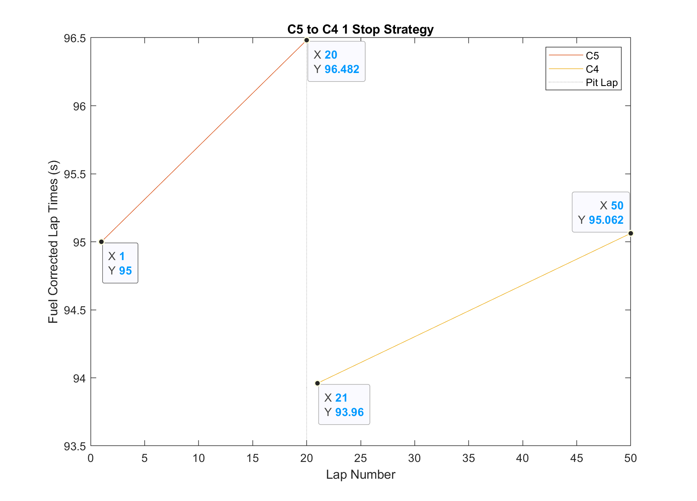

# 2023 Las Vegas GP Strategy Modelling

- [Introduction](#introduction)
- [Linear Tyre Degradation Model](#linear-tyre-degradation-model-analysis)
  - [Soft-Medium](#soft---medium-1-stop)
  - [Soft-Soft-Medium](#soft---soft---medium-2-stop)
  - [Medium-Hard](#medium---hard-1-stop)
  - [Optimal Strategy](#optimal-strategy)
  - [Next Steps](#next-steps)

## Introduction

The contents of this directory include a model of the possible strategies for the brand new Las Vegas Grand Prix, and the appropriate plots and total racetime calculations. The Las Vegas Grand Prix is 50 laps long, with a total distance covered of $305.88\ km$.

In first instance, a linear tyre degradation model has been determined based on multiple factors:

- Tyre Compounds: C3, C4, C5 Pirelli F1 Tyres: The softest in the range.

- Track Surface: The Las Vegas GP circuit is being resurfaced in advance of the event, and as such it is expected that tyre wear and grip will be lower than a track with more heavily worn surfaces.

- Expected Temperatures: The Las Vegas Grand Prix will take place at night in mid-November, where typical ambient air temperature is 10-20C, and expected surface temperatures will be relatively low compared to many other Grand Prix in the 2023 season.

- Expected Weather: The typical weather in Las Vegas in mid November indicates an unlikely chance of rain during the race.

- Track Evolution: It is expected that as the track surface "rubbers in" it will increase in grip dramatically over the course of a session and the weekend, given it is a brand new surface (so-called "green") prior to the event, as the Formula1 and support race vehicles complete each lap more rubber is laid down and the grip increases.

The pre-determined common race strategy configurations analysed below are compared based on their total predicted racetime due to the following considerations:

- Circuit Characteristics: Given the track layout and width, featuring long straights with DRS activation zones, it is expected that overtaking will be possible, therefore priorisitising overall racetime in a strategy compared to a defensive track position approach should be favourable.

- Safety Car and VSC Probability: It is expected that the probability of an SC or VSC during the race will be high, given that drivers and teams will have minimal experience on this circuit, no historical data on vehicle, tyre, and track surface performance outside of free practice, and the proximity of the walls with the track edge.

- Qualifying Position: Determining the optimal strategy depends on qualifying position, and can dictate how much risk is appropriate in the tyre strategy.

- Pitstop Time Loss: Average pit time loss is typically $\approx 20s$.

# Linear Tyre Degradation Model Analysis

Starting by defining an initial lap tyre pace delta of $0.5s$ for each compound, and assuming linear tyre degradation factors for each, we devise the following model:

Noting the y-axis indicates the "fuel-corrected laptimes," there are further assumptions made on total fuel load, laptime gains per kg of fuel-burn, and fuel-burn rate. 

Fuel Efficiency and Total Fuel Load: $$110\ kg / 50\ laps = 2.2\ kg/lap$$

Laptime Fuel-Correction: $$0.035s / 1kg\ \times 2.2kg/lap = 0.077 s/lap$$

This linear tyre model clearly shows the tyre degradation trend for each compound assuming no maximum absolute life. Improvements to the tyre model in the form of more accurate data for compound degradation rate and absolute life would be possible using histroical data for the C3, C4, and C5 tyres, as well as Driver-in-the-loop simulation and free practice session telemetry. In all likelihood, the real tyre model would be non-linear, modelling the tyre "cliff", the point at which the tyre is critically worn and laptime increases significantly.

Based on this simplified linear tyre model estimate, 3 common race strategies have been modelled and compared:

1. C5 Soft -> C4 Medium. (1 Stop)
2. C5 Soft -> C5 Soft -> C4 Medium. (2 Stop)
3. C4 Medium -> C3 Hard. (1 Stop)

Note: Each model does incorporate the pit stop time losses within the total race time, this is not shown in the fuel-corrected laptime plots but simply added to the total race time for the appropriate number of pit stops.

### Soft - Medium (1 Stop)

Total Racetime = $4770.1\ seconds$ ($\approx79.5\ minutes$)

Average Speed = $230.8\ km/h$

### Soft - Soft - Medium (2 Stop)

Total Racetime = $4772.4\ seconds$ ($\approx79.5\ minutes$)

Average Speed = $230.7\ km/h$

### Medium - Hard (1 Stop)

Total Racetime = $4777.6\ seconds$ ($\approx79.6\ minutes$)

Average Speed = $230.5\ km/h$

## Optimal Strategy

From the 3 strategy options above, it is clear to see the fastest overall racetime is achieved with a Soft (C5)-Medium (C4) 1 stop strategy, followed by the 2 stop C5, C5, C4 configuration, and finally the single stop Medium (C4)-Hard (C3) option. This is true for the linear tyre degradation and pace model described above, however with more accurate tyre models and data, a more robust strategy solution can be developed.

Considering race scenarios, it is expected that a safety car or virtual safety car will occur during the race. For this reason, starting on the C5 tyre and aiming for a single stop around lap 20 should offer flexibility in the case of an early safety car or VSC (laps 8-13), converting to the 2 stop C5, C5, C4 strategy and gaining an advantage via minimising time loss when pitting under SC or VSC conditions. Equally, for a late SC or VSC (laps 35-40), assuming a scenario where the 1 stop C5 to C4 strategy is already executed, then there is freedom to switch back to the slightly alternative 2 stop configuration of C5, C4, C5; finishing the race with a fast stint on the softs. These decisions should always be anticipated and modelled in advance of a Grand Prix to determine the "safety car window," but the decision to execute these options varies with the specific scenario and relative position of competitors. In addition to the safety car flexibility, starting on the soft compound, particularly in a race with a low-traction surface and low track temperature, enables the driver and vehicle to quickly generate suitable operating temperature in the tyre, maximising grip and therefore laptime. This early phase of the race is essential, and getting the tyres working at their optimum as quick as possible can enable significant gains off the start line, or assist in defending a good qualifying position.

In conclusion, a race strategy prediction is only as good as the accuracy of tyre and track data fed into a model, and can be further optimised by considering specific strengths and weaknesses of the vehicle, including fuel consumption, tyre usage and DRS or aerodynamic efficiency. Driver-in-the-loop simulation can be of great benefit for generating strategic models, especially given the lack of historic data for the Las Vegas GP.

## Next Steps

- Developing a non-linear tyre model more accurate to reality, representing the "cliff" or significant dropoff in performance at a given point.

- Further in-depth analysis of appropriate SC and VSC windows to optimise the strategy even under specific circumstances.