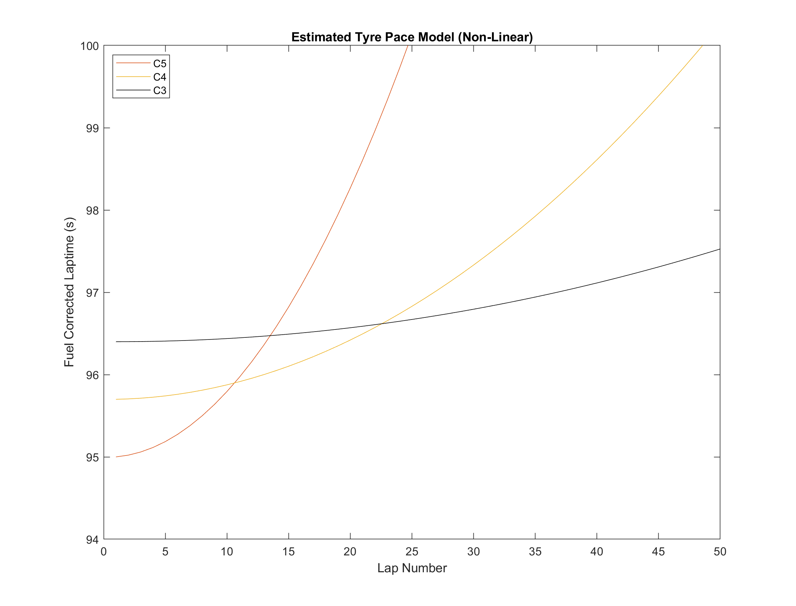
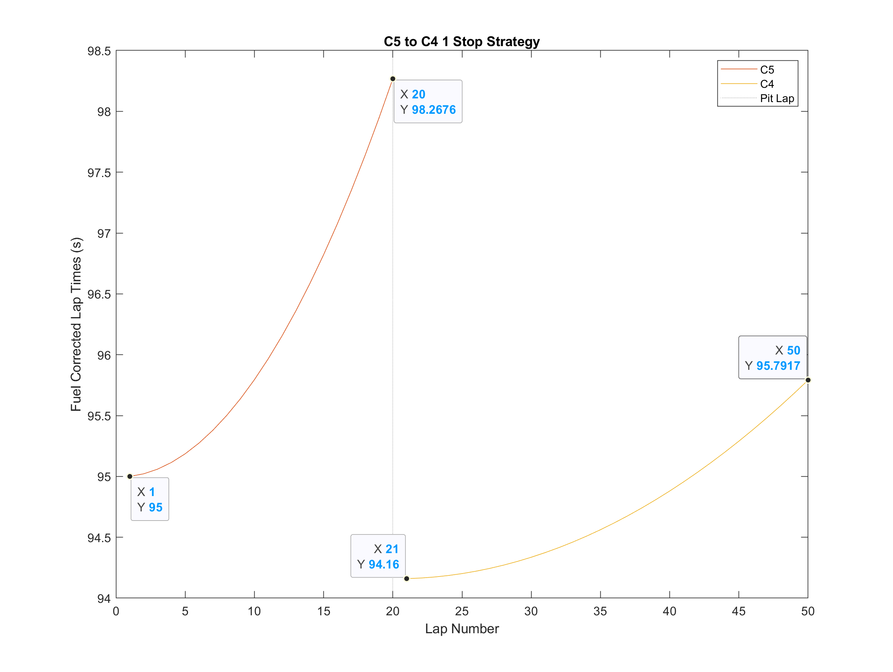
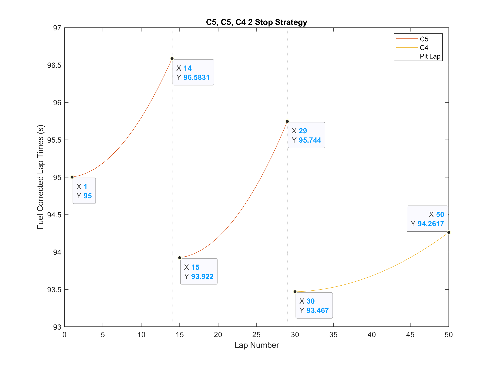
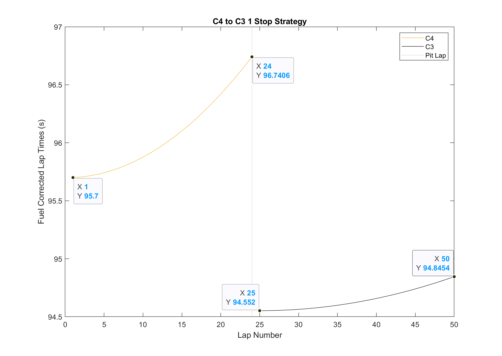
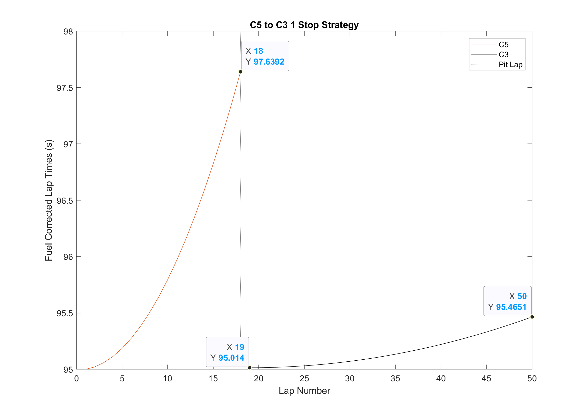
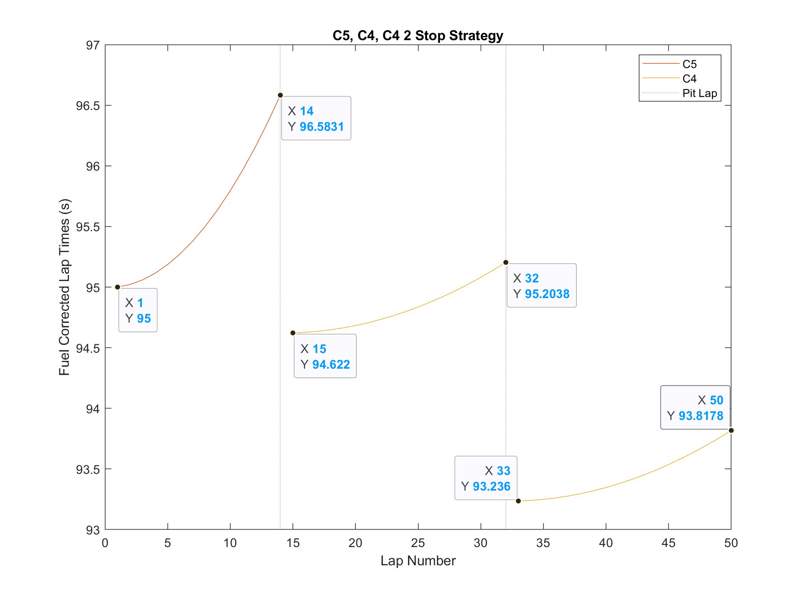

# 2023 Las Vegas GP Strategy Modelling

- [Introduction](#introduction)
- [Linear Tyre Degradation Model](#linear-tyre-degradation-model-analysis)
  - [Soft-Medium](#linear-soft---medium-1-stop)
  - [Soft-Soft-Medium](#linear-soft---soft---medium-2-stop)
  - [Medium-Hard](#linear-medium---hard-1-stop)
  - [Optimal Strategy](#optimal-strategy)
  - [Next Steps](#next-steps)
- [Non-Linear Tyre Degradation Model](#non-linear-tyre-degradation-model-analysis)
  - [Soft-Medium](#non-linear-soft---medium-1-stop)
  - [Soft-Soft-Medium](#non-linear-soft---soft---medium-2-stop)
  - [Medium-Hard](#non-linear-medium---hard-1-stop)
  - [Soft-Hard](#non-linear-soft---hard-1-stop)
  - [Soft-Medium-Medium](#non-linear-soft---medium---medium-2-stop)
  - [Optimal Strategy](#optimal-strategy-1)

## Introduction

The contents of this directory include a model of the possible strategies for the brand new Las Vegas Grand Prix, and the appropriate plots and total racetime calculations. The Las Vegas Grand Prix is 50 laps long, with a total distance covered of $305.88\ km$.

In first instance, a linear tyre degradation model has been determined based on multiple factors:

- Tyre Compounds: C3, C4, C5 Pirelli F1 Tyres: The softest in the range.

- Track Surface: The Las Vegas GP circuit is being resurfaced in advance of the event, and as such it is expected that tyre wear and grip will be lower than a track with more heavily worn surfaces.

- Expected Temperatures: The Las Vegas Grand Prix will take place at night in mid-November, where typical ambient air temperature is 10-20C, and expected surface temperatures will be relatively low compared to many other Grand Prix in the 2023 season.

- Expected Weather: The typical weather in Las Vegas in mid November indicates an unlikely chance of rain during the race.

- Track Evolution: It is expected that as the track surface "rubbers in" it will increase in grip dramatically over the course of a session and the weekend, given it is a brand new surface (so-called "green") prior to the event, as the Formula1 and support race vehicles complete each lap more rubber is laid down and the grip increases.

The pre-determined common race strategy configurations analysed below are compared based on their total predicted racetime due to the following considerations:

- Circuit Characteristics: Given the track layout and width, featuring long straights with DRS activation zones, it is expected that overtaking will be possible, therefore priorisitising overall racetime in a strategy compared to a defensive track position approach should be favourable.

- Safety Car and VSC Probability: It is expected that the probability of an SC or VSC during the race will be high, given that drivers and teams will have minimal experience on this circuit, no historical data on vehicle, tyre, and track surface performance outside of free practice, and the proximity of the walls with the track edge.

- Qualifying Position: Determining the optimal strategy depends on qualifying position, and can dictate how much risk is appropriate in the tyre strategy.

- Pitstop Time Loss: Average pit time loss is typically $\approx 20s$.

# Linear Tyre Degradation Model Analysis

Starting by defining an initial lap tyre pace delta of $0.5s$ for each compound, and assuming linear tyre degradation factors for each, we devise the following model:

Noting the y-axis indicates the "fuel-corrected laptimes," there are further assumptions made on total fuel load, laptime gains per kg of fuel-burn, and fuel-burn rate. 

Fuel Efficiency and Total Fuel Load: $$110\ kg / 50\ laps = 2.2\ kg/lap$$

Laptime Fuel-Correction: $$0.035s / 1kg\ \times 2.2kg/lap = 0.077 s/lap$$

This linear tyre model clearly shows the tyre degradation trend for each compound assuming no maximum absolute life. Improvements to the tyre model in the form of more accurate data for compound degradation rate and absolute life would be possible using historical data for the C3, C4, and C5 tyres, as well as Driver-in-the-loop simulation and free practice session telemetry. In all likelihood, the real tyre model would be non-linear, modelling the tyre "cliff", the point at which the tyre is critically worn and laptime increases significantly.

Based on this simplified linear tyre model estimate, 3 common race strategies have been modelled and compared:

1. C5 Soft -> C4 Medium. (1 Stop)
2. C5 Soft -> C5 Soft -> C4 Medium. (2 Stop)
3. C4 Medium -> C3 Hard. (1 Stop)

Note: Each model does incorporate the pit stop time losses within the total race time, this is not shown in the fuel-corrected laptime plots but simply added to the total race time for the appropriate number of pit stops.

### Linear: Soft - Medium (1 Stop)

Total Racetime = $4770.1\ seconds$ ($\approx79.5\ minutes$)

Average Speed = $230.8\ km/h$

### Linear: Soft - Soft - Medium (2 Stop)

Total Racetime = $4772.4\ seconds$ ($\approx79.5\ minutes$)

Average Speed = $230.7\ km/h$

### Linear: Medium - Hard (1 Stop)

Total Racetime = $4777.6\ seconds$ ($\approx79.6\ minutes$)

Average Speed = $230.5\ km/h$

## Optimal Strategy

From the 3 strategy options above, it is clear to see the fastest overall racetime is achieved with a Soft (C5)-Medium (C4) 1 stop strategy, followed by the 2 stop C5, C5, C4 configuration, and finally the single stop Medium (C4)-Hard (C3) option. This is true for the linear tyre degradation and pace model described above, however with more accurate tyre models and data, a more robust strategy solution can be developed.

Considering race scenarios, it is expected that a safety car or virtual safety car will occur during the race. For this reason, starting on the C5 tyre and aiming for a single stop around lap 20 should offer flexibility in the case of an early safety car or VSC (laps 8-13), converting to the 2 stop C5, C5, C4 strategy and gaining an advantage via minimising time loss when pitting under SC or VSC conditions. Equally, for a late SC or VSC (laps 35-40), assuming a scenario where the 1 stop C5 to C4 strategy is already executed, then there is freedom to switch back to the slightly alternative 2 stop configuration of C5, C4, C5; finishing the race with a fast stint on the softs. These decisions should always be anticipated and modelled in advance of a Grand Prix to determine the "safety car window," but the decision to execute these options varies with the specific scenario and relative position of competitors. In addition to the safety car flexibility, starting on the soft compound, particularly in a race with a low-traction surface and low track temperature, enables the driver and vehicle to quickly generate suitable operating temperature in the tyre, maximising grip and therefore laptime. This early phase of the race is essential, and getting the tyres working at their optimum as quick as possible can enable significant gains off the start line, or assist in defending a good qualifying position.

In conclusion, a race strategy prediction is only as good as the accuracy of tyre and track data fed into a model, and can be further optimised by considering specific strengths and weaknesses of the vehicle, including fuel consumption, tyre usage and DRS or aerodynamic efficiency. Driver-in-the-loop simulation can be of great benefit for generating strategic models, especially given the lack of historic data for the Las Vegas GP.

## Next Steps

- Developing a non-linear tyre model more accurate to reality, representing the "cliff" or significant dropoff in performance at a given point.

- Further in-depth analysis of appropriate SC and VSC windows to optimise the strategy even under specific circumstances.

# Non-Linear Tyre Degradation Model Analysis

Starting by defining an initial lap tyre pace delta of $0.7s$ for each compound, and non-linear tyre degradation factors in order to better represent the finite lifespan of each compound and the tyre "cliff" or "dropoff." This non-linear model was constructed by generating continually increasing tyre wear factors for each lap, with a steeper rate of increase for the softer of the tyres. While a slightly different tyre pace delta is assumed in this model compared to the linear trye degradation model, we still consider the overall wear on the circuit to be minimal due to track characteristics, temperature, and surface as described in the [introduction](#introduction). The resulting non-linear tyre degradation model is given:

Once again we assume a $0.077s/lap$ improvement due to fuel burn reducing the overall mass of the car, and we consider the same 3 strategies as in the [linear model](#linear-tyre-degradation-model-analysis), in addition to 2 more:

1. C5 Soft -> C4 Medium. (1 Stop)
2. C5 Soft -> C5 Soft -> C4 Medium. (2 Stop)
3. C4 Medium -> C3 Hard. (1 Stop)
4. C5 Soft -> C3 Hard. (1 Stop)
5. C5 Soft -> C4 Medium -> C4 Medium. (2 Stop)

Note: Each model does incorporate the pit stop time losses within the total race time, this is not shown in the fuel-corrected laptime plots but simply added to the total race time for the appropriate number of pit stops.

### Non-Linear: Soft - Medium (1 Stop)

Total Racetime = $4785.0\ seconds$ ($\approx79.7\ minutes$)

Average Speed = $230.1\ km/h$

### Non-Linear: Soft - Soft - Medium (2 Stop)

Total Racetime = $4765.4\ seconds$ ($\approx79.4\ minutes$)

Average Speed = $231.1\ km/h$

### Non-Linear: Medium - Hard (1 Stop)

Total Racetime = $4786.5\ seconds$ ($\approx79.8\ minutes$)

Average Speed = $230.1\ km/h$

### Non-Linear: Soft - Hard (1 Stop)

Total Racetime = $4792.3\ seconds$ ($\approx79.9\ minutes$)

Average Speed = $229.8\ km/h$

### Non-Linear: Soft - Medium - Medium (2 Stop)

Total Racetime = $4767.0\ seconds$ ($\approx79.4\ minutes$)

Average Speed = $231.0\ km/h$

## Optimal Strategy

In this non-linear degradation model, it is now clear that a two stop strategy is the fastest method of completing the race; with the Soft-Soft-Medium 1.6 seconds faster than the Soft-Medium-Medium strategy. These two strategy options are significantly faster than the single stop counterparts, meaning the time improvement from running on fresher, faster tyres easily offsets any time loss from the additional pit stop. 

It is important to conider track characteristics when considering a single vs multi-stop race strategy, as conceding track position by taking an extra pitstop is only beneficial if the team and driver are confident in the ability to re-overtake others, and regain any positions lost. In this instance, we have already identified the long straights with DRS zones to facilitate overtaking opportunities at the Las Vegas circuit, thus indicating track position will be difficult to defend on worn, slow tyres (unlike at a track such as Monaco), and thus we will continue to assume an optimised race duration is the best strategic approach.

With the Hard tyre performing poorly in this model, our choice is between the Soft-Soft-Medium and Soft-Medium-Medium configurations. Given the close performance of these two strategies in this model, distinguishing the optimal of the two would liekly be achieved through driver-in-the-loop simulation, and free practice data from the circuit during a Grand Prix weekend. In addition, depending on the tyre allocation of a team or driver, or any potential incidents in qualifying or practice (including wheel lock-ups that may flat spot a tyre) this choice may not exist. There could be a scenario whereby a driver will have 2 new sets of medium compound tyres and the starting soft tyre, but only worn and heavily used spare softs, thus it would be better to commit to a soft-medium-medium strategy to make the most of the new tyres available.

Available new tyres aside, and track position aside, I would conclude an optimal strategy from this model to be starting on the soft compound tyre (C5), before pitting for mediums on lap 14, and then pitting again for either soft or medium tyres depending on safety car or VSC scenarios. In this configuration, starting on the soft tyre allows for flexibility to go with either strategy, and depending on the real-time race data and soft tyre degradation, the optimal strategy may become shifting heavily one way or the other if the softs are better or worse than expected. For a potential early safety car (laps 9-14) then a pit stop onto the medium tyre could be made, building in more flexibility to go for a single stop strategy if the tyre wear/life allows and track position proves more valuable than expected, or alternatively give a broader range of laps with which to pit a second time, as the medium tyre degradation is not as severe as the soft compound. This larger range for the second pit stop translates to an increased chance of choosing to pit if a SC or VSC is called out. Having run both the soft and medium tyre during the race also provides valuable real-time data, and driver feedback opportunities to determine the best tyre choice for the final stint. If it is concluded that the soft tyre has strong pace and predictable tyre degradation with a life span that will hold up for the remaining laps, the driver is confident in their ability to push and manage the compound as required, and there is a fresh or scrubbed set available, then a fast final stint on the C5 would be optimal. However, if the characteristics of the car are better suited for a more robust medium compound final stint, and the team and driver are confident in the pace with the C4, then it may be a better option.

In summation, generating as much information and data in real-time to accurately determine the tyre performance and lifespan is key, taking into consideration the driver feedback and car-specific characteristics on tyre wear. Building in flexibility to a race strategy is also extremely valuable, improving the ability to adapt to unexpected scenarios such as (virtual) safety cars, red flags and weather changes, thus increasing the liklihood of maximising the opportunities that can arise from these scenarios.